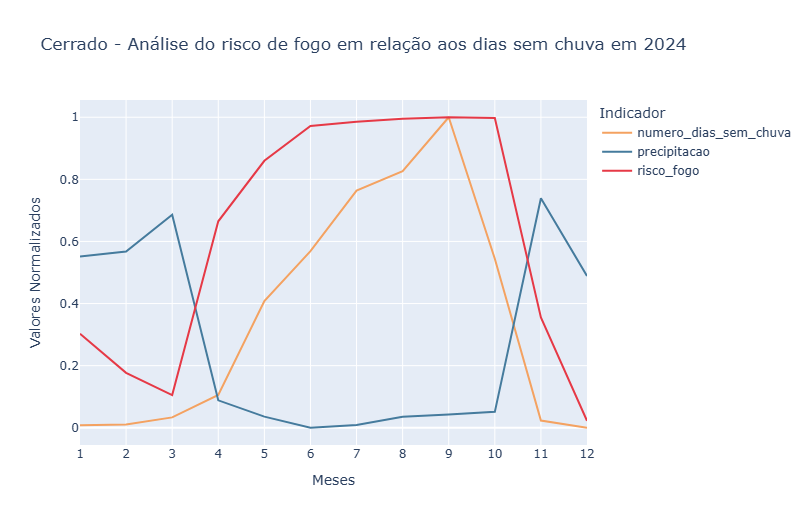
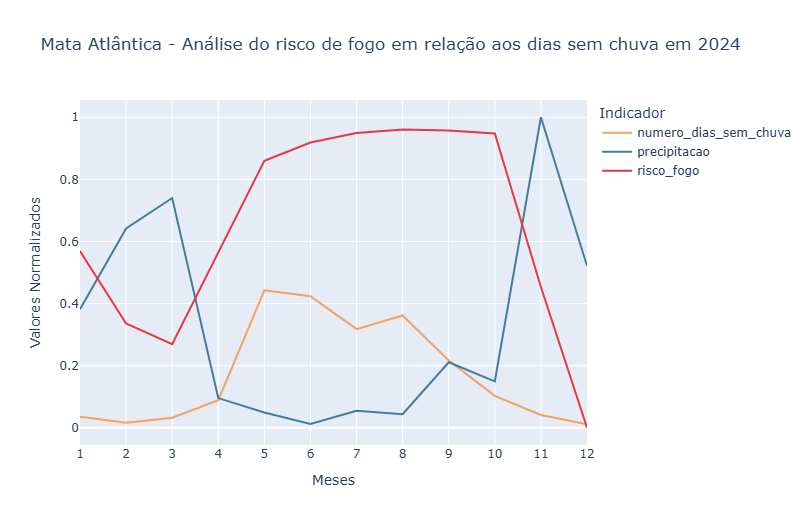

# Análise de queimadas em relação aos dias sem chuva no estado de São Paulo em 2024

###

Projeto acadêmico, realizado no 3° semestre de Sistemas de informação na Universidade Católica de Santos, nas matérias de Estrutura de dados, Linguagens de programação e Segurança da informação.

O projeto visa analisar os dados do ano de 2024 referente as queimadas do estado de São Paulo, relacionando os riscos de incêndio com os dias sem chuva e preciptação, analisando padrões climáticos e sazonais.

Foi utilizado Python para a filtragem e limpeza dos dados, utilizando a biblioteca Pandas, a biblioteca Plotly também foi utilizada para a elaboração de gráficos, facilitando a leitura dos dados e comparação das datas.

Código elaborado via Google colab, basta baixar o arquivo .ipynb e fazer o upload no colab. Também é necessário fazer o upload do arquivo 'focos_br_todos-sats_2024.csv' no "My Drive" para que o colab consiga importalo para o ambiente virtual. 

Uma possível melhoria seria a funcionalidade de rodar o código no VSCode, não conseguir achar um jeito decente de fazer isso, mas deixo como uma melhoria futura.

Imagens dos gráficos finais, já normalizados e formatados, gerados através do código:

